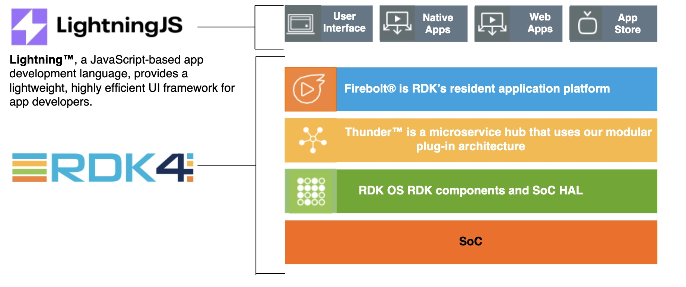

<!-- External component -->
import Card from '@mui/material/Card';
import CardActions from '@mui/material/CardActions';
import CardContent from '@mui/material/CardContent';
import CardMedia from '@mui/material/CardMedia';
import Button from '@mui/material/Button';
import Typography from '@mui/material/Typography';
import FeatureBar from '@site/src/components/RDK-components/FeatureBar'

<Card sx={{ display: 'flex' }}>
      <CardMedia
        component="img"
        height="240"
        image="https://source.unsplash.com/random?video"
      />
      <CardContent>
        <Typography gutterBottom variant="h5" component="div">
          RDK-V
        </Typography>
        <Typography variant="body2" color="text.secondary">
          RDK-V accelerates the deployment of next -gen video products and services, simplifying customization and user experience.
        </Typography>
      </CardContent>
</Card>

---

# Overview

**RDK Video (RDK-V)** IP provides a common method to manage video playback functions. The IP client device serves as an interface and receives video content from an in-home media gateway device or from an external media serve

## RDK-V IP

| **RDK-V IP Features**                                        |
| ------------------------------------------------------------ |
| Content  Delivery - VOD, SDV, iPPV, Video over Wi-Fi         |
| Digital Rights Management  (DRM)   Adobe® Access , PlayReady® & Widevine |
| Emergency alert system                                       |
| Cast screening                                               |
| Adaptive bit rate with MPEG-DASH                             |
| Codecs support for HDR 10 bit  (HEVC HLS)                    |
| Video output resolutions up to  Ultra HD/4K & HDR            |
| Closed captioning                                            |
| Copy protection                                              |
| Song track identification                                    |
| Audio output formats, including  Dolby® MS12                 |
| Customizable video telemetry                                 |

## RDK-V Hybrid

RDK-V Hybrid provides a common method to manage complex video functions such as tuning, conditional access, DRM, and stream management.

| RDK-V Hybrid Features                        |
| -------------------------------------------- |
| QAM & DVB  Tune                              |
| IPTV & VOD                                   |
| Media streaming to in-home devices           |
| Home networking                              |
| Recording                                    |
| Customizable telemetry &  feature control    |
| Progressive Download                         |
| Diagnostics support                          |
| Closed captioning                            |
| Support for all popular streaming  protocols |
| Conditional access & DRM                     |
| Premium apps                                 |

##RDK4

RDK4** is the latest version of the RDK-V software stack, designed to simplify app development and integration on any set-top device while allowing companies to maintain complete control of their apps, device data, and customer experience.

RDK4 is designed for use with Lightning™, a JavaScript-based app development language, but also supports HTML5 web apps and native streaming video apps integrated through Firebolt®.

<FeatureBar featureText="Global streaming apps: RDK features pre-integrated top global streaming apps,
providing operators with an easy path to offer today’s most popular content to subscribers." ></FeatureBar>
