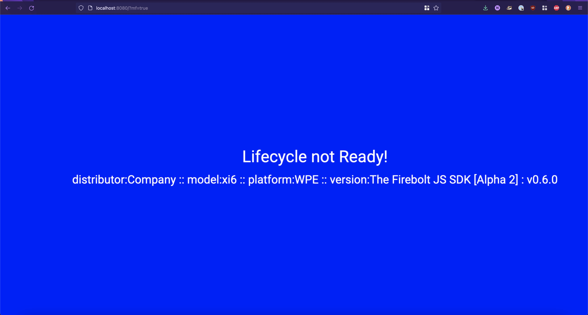

# Welcome

In this practical guide, you'll learn how to get up and running so you can build a simple single-page app using Firebolt®. It will show you fundamentals like importing modules and how to use the Device and Lifecycle modules.

The *\"Hello World\"* guide is designed with the following assumptions:

-   You have some experience with the basics of programming (building apps, working with APIs, etc) and have some experience working with the JavaScript programming language. This guide does not explain object-oriented programming or the JavaScript language.

-   You know what a "Single-Page App" is, and how they work.

-   You understand JavaScript runtime tools like Node and NPM.

-   You understand how to install and use JavaScript packages on your local machine.

## What you'll need

- A computer running Windows or Linux, or a Mac running macOS.

- Internet access or an alternative way of loading the latest Firebolt® SDK and Lightning™ JavaScript framework onto your computer.

-   Install Lightning™. No prior knowledge of Lightning™ is required, but it is a required dependency for this project.
    1. Using your machine's command-line interface (CLI), input the command:

        ```
        npm install -g @lightningjs/cli
        ```

    2. For more detail on installing Lightning™ go here:

       >  https://lightningjs.io/docs/#/getting-started/index

## What you'll learn

-   How to import Firebolt® modules.

-   How to register your Firebolt® events for the Lifecycle & Device modules.

## What you'll do

-   Install the necessary dependencies for this tutorial.

-   Create a blank project using Lightning™, which will allow you to use the Firebolt® SDK.

-   Install the Firebolt® SDK.

-   Install all the dependencies you'll need to use the Firebolt® SDK.

-   Generate and build your app in a browser.

-   Explore and view the app you've built.

# App Overview

After you successfully install Lighting Studio, get Firebolt® up and running, and create your app, at the end of all that your finished app should look something like this:


# Installing Node

**This is not required if you already have Node.**

> \"**Node.js** is an [open-source](https://en.wikipedia.org/wiki/Open-source_software), [cross-platform](https://en.wikipedia.org/wiki/Cross-platform), [back-end](https://en.wikipedia.org/wiki/Front_end_and_back_end) [JavaScript](https://en.wikipedia.org/wiki/JavaScript) [runtime environment](https://en.wikipedia.org/wiki/Runtime_system) that runs on the [V8 engine](https://en.wikipedia.org/wiki/V8_(JavaScript_engine)) and executes JavaScript code outside a [web browser](https://en.wikipedia.org/wiki/Web_browser). Node.js lets developers use JavaScript to write command line tools and for [server-side scripting](https://en.wikipedia.org/wiki/Server-side_scripting)---running scripts server-side to produce [dynamic web page](https://en.wikipedia.org/wiki/Dynamic_web_page) content before the page is sent to the user's web browser. Consequently, Node.js represents a \"JavaScript everywhere\" paradigm, unifying [web-application](https://en.wikipedia.org/wiki/Web_application) development around a single programming language, rather than different languages for server-side and client-side scripts.\"\
> <https://en.wikipedia.org/wiki/Node.js>

## Installing for Windows

**Prerequisites**

It's assumed that you have the ability to download and install software on your machine as well as have access to a command-line interface (CLI) tool such as Windows' command line or PowerShell.

### Step 1:

**Download Node.js Installer**: In a web browser, put in the URL <https://nodejs.org/en/download/>. Select the **Windows Installer** button to download the latest default version. The Node.js installer includes the NPM package manager.


### Step 2: Install Node.js and NPM from the browser:

1.  Once the installer finishes downloading, launch it. Go to the location where you have saved the file and double-click it to launch.

2.  The system will ask if you want to run the software -- select **Run**.

3.  You will be welcomed to the Node.js Setup Wizard -- select **Next**.

4.  On the next screen, review the license agreement -- select **Next** if you agree to the terms and install the software.

5.  The installer will prompt you for the installation location. Leave the default location, unless you have a specific need to install it somewhere else -- then select **Next**.

6.  The install wizard will let you select components to include or remove from the installation. Again, unless you have a specific need, accept the defaults by selecting **Next**.

7.  Finally, select the **Install** button to run the installer. When it finishes, select **Finish**.

### Step 3: Verify Installation:

Open PowerShell or your preferred command-line tool and enter the following:

    node -v

The system should display the Node.js version installed on your system. You can do the same for NPM:

    npm -v

## Installing for Mac

**Prerequisites**

Node on Mac can be installed directly from Node.js or it can be installed with tools like [Homebrew](https://brew.sh/). For this installation, we're going to keep it as simple as possible and go directly to Node.js. However, you may use a package manager tool such as Homebrew if you prefer.

It's assumed that you have the ability to download and install software on your machine as well as have access to a command-line interface (CLI) tool such as Mac's terminal tool.

### Step 1:

**Download Node.js Installer**: In a web browser, go to <https://nodejs.org/en/download/>. Select the **Mac Installer** button to download the latest default version. The Node.js installer includes the NPM package manager.

### Step 2:

1.  Once the installer finishes downloading, launch it. Open the location where you have saved the file and double-click it to launch.

2.  You will be introduced to the Node.js Setup Wizard -- select **Continue**.

3.  On the next screen, review the license agreement - select **Agree** if you agree to the terms and install the software.

4.  The installer will prompt you for the installation location. Leave the default location, unless you have a specific need to install it somewhere else -- then select **Install**.

    - At this point you can select **Customize** if you'd like to select components to include or remove from the installation. Again, unless you have a specific need, accept the defaults by selecting **Install**.

5.  When it finishes, select **Finish**.

### Step 3: Verify Installation:

Open Terminal or your preferred command-line tool and enter the following:

    node -v  

The system should display the Node.js version installed on your system. You can do the same for NPM:

    npm -v

## Installing for Linux

Linux has many options - here is our favorite "How-to guide" on installing Node.js for your Linux machine. <https://upstack.co/knowledge/how-to-install-node-js-on-linux>

# Getting Started - Install Lightning & Firebolt

### Step 1 - Clone the Hello World Github repo

1. Using any method you prefer, `git clone` or the Github desktop client, or a third way use the URL https://github.com/rdkcentral/firebolt-hello-world and clone the *Hello World* repo.

   ```
   git clone https://github.com/rdkcentral/firebolt-hello-world.git
   ```

   

2. Open your command-line interface (CLI) tool and change your directory to the repo you just cloned.

   ```
   cd firebolt-hello-world/pt1-firebolt_hello_world-start
   ```

3. With CLI in the \"hello_world\" directory run the command

   ```
   npm install
   ```

4. This will install the `package.json` file and any other dependencies.
   1. **Optional:** Depending on your machine you may need to install what is called `pug` which is an HTML pre-processor. If you're curious and want to learn more go here <https://www.sitepoint.com/a-beginners-guide-to-pug>. In the meantime run the command `npm install pug`. If step 4 continues to show up as an error or you see something like `Error: Cannot find module 'pug'` then run the above command.

5. In your CLI use the commands

   ```
   npm run build & npm run dev
   ```

This will build the `package.json` file in the directory and it will then compile it, with all the assets, including a source map. Ideally, making it easier to check for errors. After you've run `npm run build` & `npm run dev` your default browser should pop up and you should see,


### Step 2: Install the Firebolt® SDK

1.  In the CLI use the command use the command

        npm install @firebolt-js/sdk

1.  Once that's done use the same commands as above

        npm run build & npm run dev

### Step 3: Import the Device and Lifecycle Modules from Firebolt®

In the file `src/App.js` add the line

```javascript title="src/App.js"
import { Lifecycle, Device } from '@firebolt-js/sdk';
```

right below the other import(s).

This will add the modules **Device** and **Lifecycle** to your app.

### Step 4: Add some functionality to your app

Within the *Hello World* repo you downloaded, navigate to and open the `src/App.js` file. Go to the following line within the file:

```javascript title="src/App.js"
{...
  _active() {
  }
}
```

:::info

Note that the `_active()` method is how the Lightning™ framework initiates your app and is not part of Firebolt®.

After `_active() {` here is where you put your Firebolt® code! Add the following Firebolt® code on a new line:

:::

```javascript title="src/App.js"
Device.distributor()
.then(distributor => {
  const deviceDistributor = 'distributor:' + distributor;
  this.tag('Device').text.text = deviceDistributor + ' :: ';
});

Device.model()
.then(model => {
  const deviceModel = 'model:' + model;
  this.tag('Device').text.text += deviceModel + ' :: ';
});

Device.platform()
.then(platform => {
  const devicePlatform = 'platform:' + platform;
  this.tag('Device').text.text += devicePlatform + ' :: ';
});

Device.version()
.then(version => {
  const deviceVersion = 'version:' + version.sdk.readable + ' : v' + version.sdk.major + '.' + version.sdk.minor + '.' + version.sdk.patch;
  this.tag('Device').text.text += deviceVersion;
});  
```

This will append the `Device` text field with the appropriate `firebolt Device` information and show it on your screen. This is the module you'd use to check things like device IDs and manufacturer makes and models.

Refresh your browser and you should now see
    


### Step 4 - Listening for events

Let's add the Lifecycle event listeners to your app. This will allow it to respond to the various Lifecycle states an app may go through.

For more information on listening to events please reference the API documentation:

> https://developer.comcast.com/firebolt/core/sdk/latest/docs/listening-for-events/

In your `App.js` file add the following code at the same level as `_active()` and `_init()`

```javascript title="src/App.js"
_registerLifecycleCallbacks() {
  Lifecycle.listen((event, value) => {
    console.log('Lifecycle.listen:', event, value);

    if (value.state) {
      console.log('Lifecycle: >> : previous state :' + value.previous, value);
      console.log('Lifecycle: >> : current state :' + value.state, value);
    }

    if (value.state == 'foreground') {
      console.log('Lifecycle : Foreground State');
      this.tag('HelloWorld').color = LifecycleColors.FOREGROUND;
      this.tag('Lifecycle').text.text = 'Lifecycle : Foreground State';
      this.tag('Complete').visible = true;
    }
    if (value.state == 'inactive') {
      console.log('Lifecycle : Inactive State');
      this.tag('HelloWorld').color = LifecycleColors.INACTIVE;
      this.tag('Lifecycle').text.text = 'Lifecycle : Inactive State';
    }
    if (value.state == 'background') {
      console.log('Lifecycle : Background State');
      this.tag('HelloWorld').color = LifecycleColors.BACKGROUND;
      this.tag('Lifecycle').text.text = 'Lifecycle : Background State';
    }
  });
}
```

Using the functions you've added we're going to call `_registerLifecycleCallbacks` in the `_active()` function. By adding the following code within the `_active()` your app will register Lifecycle events and inform Firebolt® when your app is ready to launch, also known as `'Lifecycle.ready'`

Next, add the following code to the `_active()` function.

```javascript title="src/App.js"
this._registerLifecycleCallbacks();
Lifecycle.ready();
```

Now refresh your browser and your app should display the following:

> The Lifecycle state and background color change to reflect the transitions to the 'Foreground' state


The Lifecycle state and background color change to reflect the transitions to the `Foreground` state.

You're almost finished! Right now your app is running in the mock transport layer provided by the Firebolt® SDK. That means that you can test your app and the Firebolt® API but what will be returned are static, pre-determined, values. They won't change based on your input. It's a good sanity check but not particularly robust. However, if you'd like to test your app and see dynamic values you can use Firebolts Mock application.

## Using the Firebolt® Mock Application

For a more in-depth overview of how to set up Mock Firebolt® read our setup guide here:

To use Firebolt's mock application repeat all the steps above but make these changes.

1. In [Step 1](#step-1---clone-the-hello-world-github-repo). Clone the https://github.com/rdkcentral/mock-firebolt repository instead of the one provided. This contains the dependencies that allow your app to connect to Mock Firebolt.

   ```
   git clone https://github.com/rdkcentral/mock-firebolt
   ```

2. In Step 1.2 change the directory to reflect the newly cloned repo.

   ```
   cd pt3-Firebolt_hello_world-mock
   ```

3. Follow the rest of the steps as written above. With your browser open, append `?mf=true` to the end of the URL above.


### Connect Hello World with Mock Firebolt

1.  Open a new window/tab in your command-line interface (CLI) tool and change the directory to `cd [filepath]\mock-firebolt-os` then run

        cd server

*You should still have another CLI window open to the Hello World repo.*

1.  Run these commands, in the order below

    ```
    npm install
    npm run clean
    npm run build:core
    npm run build:mf
    ```

In the same CLI window run the command

    npm run dev

Now mock OS is up and running.

1.  Open a new CLI window and type in the command

        cd cli
        npm install

Change the directory to

```
cd src
```

Now you can modify the Hello World Firebolt® app using the CLI.

### Example: Changing the distributor from *Company* to *Videos R US*

In the CLI window where you're current directory is `$ src %` use the command

    node cli.mjs --upload ../examples/device-distributor-1.json

Refresh your browser and you'll see the distributor go from `distributor: Company` to `distrubutor: Videos R Us`.




## Hello World Examples - Let's play

**Change the device model**

To change the model of the device from `model: xi6` to say `xi3000` use the command

````
node cli.mjs --upload
````

**Change your app's Lifecycle**

To send events such as methods, result keys, etc use the command

````
node cli.mjs --event
````

To change the lifecycle use the command above along with an example file path and a lifecycle `.json` file to change the state of the "Hello World App".

    node cli.mjs --event ../examples/lifecycle-initializing-to-inactive.event.json


As an example going from inactive to the foreground state would be

    node cli.mjs --event ../examples/../examples/lifecycle-inactive-to-foreground.event.json

# Conclusion

*Congratulations*, you did it! You made your very first Firebolt® app!

Now you know how to:

1.  Install Firebolt® onto your device

2.  Import Firebolt® modules

3.  Use the Device module to get the device information your app is running on

4.  Use the Lifecycle module to ensure that your app is ready to run.

To continue learning more about Firebolt® check out our [API](https://developer.comcast.com/firebolt/core/sdk/latest/api/) docs and guides.
