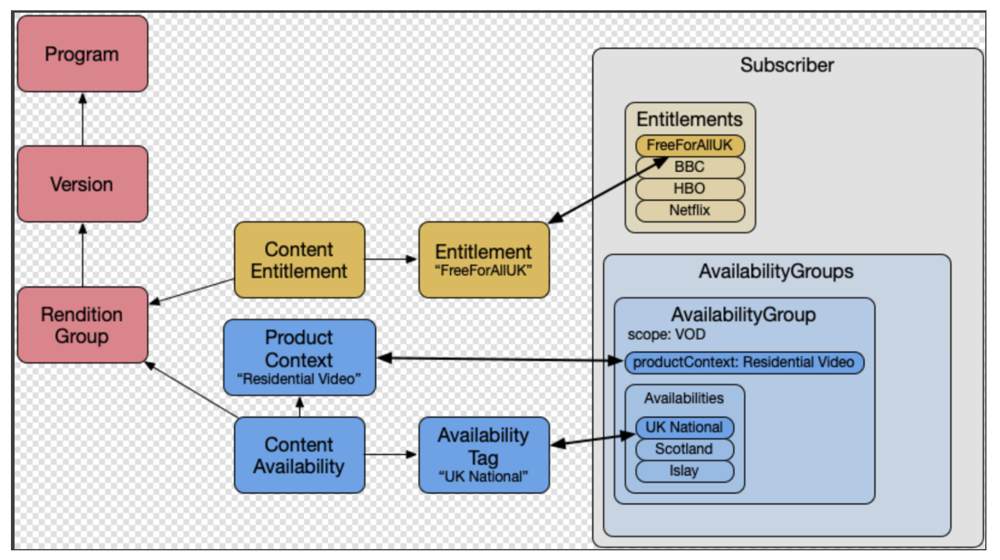

# Ingest

| Last updated | 06/08/2022 |
|--------------|------------|
| Author       | ?!?        |
| Reviewer     | Seth Kelly |

## Status
**[DRAFT]**
## Index
**[TBD]**
## Overview
This is connected to but separated from XVP.
Ingest capabilities are provided by XMP platform.
## Merlin
Merlin coordinates ingest of a variety of data such as TV Shows, Movies, Sports, Music, etc.

It constructs a cannonical representation of entities from each of these domains based on multiple data sources.

It also provides general purpose content ingest platform.
Content is ingested into Merlin-managed accounts and can either be automatically
approved and published by Merlin or queued up for being editorially matched to existing content.
Clients need to set up a new Open Ingest content source.

Beyond content ingest, Merlin also provides a number of services in support of:

* entities
* entitlements & availabilities
* ID mappings
* change notification

Other Merlin services:

* [Merlin Services](https://etwiki.sys.comcast.net/display/COMPASS/Merlin+Services)

### Gracenote
Unbound Metadata
### Content Providers
Bound Metadata
## Content & Subscriber Model
Content Visibility on X1 is dictated by the intersection of ContentAvailability and ContentEntitlements with Subscriber AvailabilityGroups (known as the ARS Blob) and Entitlements.

Where an availability group is a combination of catalogs (e.g. VOD) and availabilities (e.g. "UK National").
ARS stands for the Availability Resolution Service, which provides ARS blobs, that are then exchanged with other Comcast systems e.g. CRS, REX.

Through the backoffice, partners needs to:

Create the various Availability and Catalogue Tags
Create the various Entitlements
Apply the tags and entitlements to the Content
Apply the tags and entitlements to Subscribers
The join of the Availability Groups and Entitlements can be seen below:

## Partner Backoffice
* Bridge to XMP documentation - external
## References
This section is for internal use - not to be published.

* [Merlin Open Ingest](https://etwiki.sys.comcast.net/display/COMPASS/Merlin+OpenIngest)
* [Merlin Open Ingest Specs](https://etwiki.sys.comcast.net/display/COMPASS/Open+GMRSS+Specificationhttps://github.comcast.com/pages/merlin/mmpWebService/2.0/openingest/)
