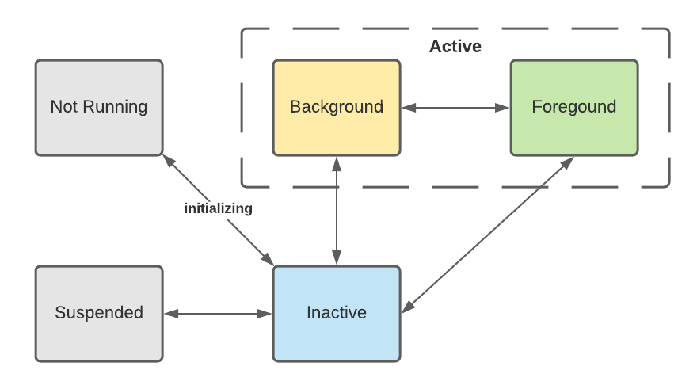
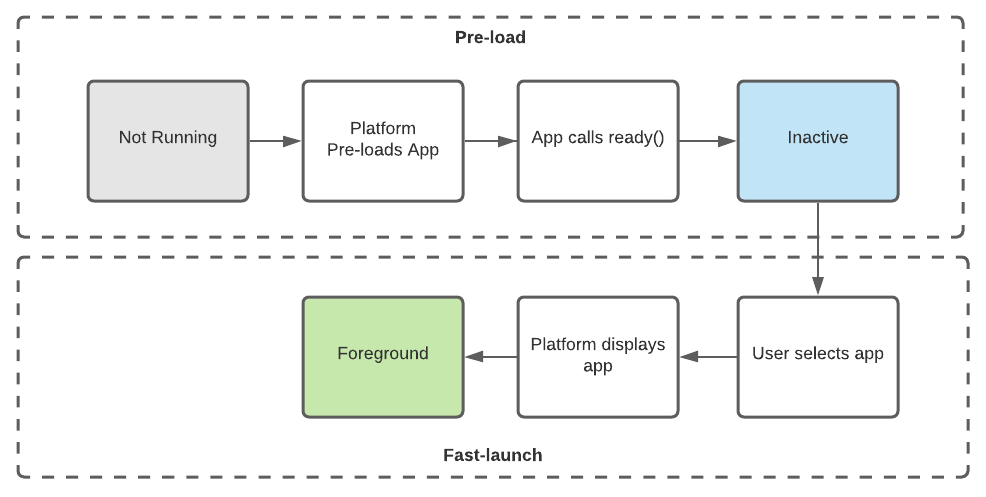
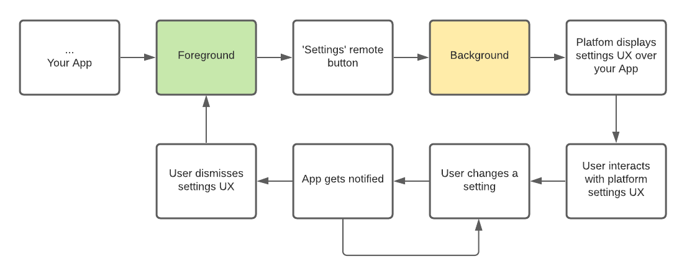

  

# App Lifecycle

The app lifecycle is how the platform informs your app how to behave based on its state. These lifecycle states determine which features and APIs should be used and when.

## What are the App States

States are how your app understands whether it is the user's primary focus and if certain capabilities, e.g. receiving remote key presses, are available. The states your app can be in are as follows.

| Lifecycle State | Description |
| --------------- | ----------- |
| _not running_   | Application is not running and not loaded in memory |
| `inactive`      | Application is loaded but not visible. It does not receive any remote/keyboard input and cannot play media. It must free any non-required memory (such as AV buffers) and minimize network and CPU usage (ie: disable or reduce the frequency of timers, disabling animations, closing web sockets). It should replace the UI with a full-screen loading splash screen so that this will be the first thing displayed when transitioning into Active or Background state. |
| `suspended`     | Inactive app has been suspended to RAM so no resources are available, but will maintain state.
| `foreground`&nbsp;(Active) | Application is visible full screen, receives inputs, and can play media. |
| `background`&nbsp;(Active) | Application is *partially* or *not* visible, can play media, and *does not* receive key press events except for play and pause. |

## What is an App State Transition

A state transition is when the platform moves your app from one state, for example going from `inactive`, to another, `foreground`.

<center>
FIGURE 1: This image represents all of the possible states your App can transition to and from.



</center>

When your app is first loaded it will stay in the transitory `initializing` state. The platform will never transition your app out of the `initializing` state until you call `ready()`. Once `ready()` is called, your app will be moved to the `inactive` state. From there, [several use cases](#example-state-flows) are possible.

Your app will not transition to `foreground` without going through either `inactive` or `background` first.

## App Responsibility for each State

When your app transitions into a new state, there are some responsibilities it should handle in order to ensure efficient running of all apps.

| Lifecycle State | Responsibilities |
| --------------- | ----------- |
| `inactive`      | Free any unrequired memory (such as AV buffers) and minimize network and CPU usage (ie: disable or reduce the frequency of timers, disabling animations, closing web sockets). It may replace the UI with a full-screen loading splash screen so that this will be the first thing displayed when transitioning into the `foreground` or `background` states. |
| `inactive` (from `suspended`)     | When returning from `suspended` your app may need to refresh any sessions, timers, or tokens that it uses to run smoothly. `suspended` apps have had their CPU usage frozen for un unknown amount of time. |
| `foreground` | The only responsibility here is to provide a great experience for your users! |
| `background` | Consider reducing video quality |

## Managing your App's Lifecycle

### Getting your app Ready
In order to give your app complete control over when it is presented to the user, the platform provides the [`Lifecycle.ready()`](/api/lifecycle/#ready) method. This allows the platform to wait for your app to be functionally and visually prepared for the user, and prevents the platform from waiting any longer than necessary.

This needs to be called before your App can be put into the `foreground`. This must only be called once. If your app is going to respond to any event(s) then it’s a best practice to [`listen()` to those events](./listening-for-events.md) before calling `ready()`.

Your app is ready when these three requirements are met.

| Requirement   | Description |
| ------------- | ----------- |
| Response Time | The time it takes for your app to show a response to a user key-press must be less than 100ms. For example, user selects 'play' and it either starts playing or a 'loading' icon appears within 100ms. |
| Playback Start | The amount of time between a user requesting playback and the asset starting playback must be less than 3 seconds. |
| Deep Linking | Your app must support [Deep linking, via Navigation Intents](./deep-linking.md) |

Here is an example that listens for deep links, and then calls `ready()`:

```javascript
import { Lifecycle, Discovery } from '@firebolt-js/sdk'

Discovery.listen('navigateTo', (value) => {
  if (value.action == 'entity') {
    // navigate to the entity page
    callMyCustomNavigateFunction(value.data.entityId)
  }
}

Lifecycle.ready()
```

This example shows how an App can use the `Discovery.listen()` to ready itself for when the user wants to go to a specific piece of content. When the app is .ready() it will give the user the ability to find that content. 

Note that `callMyCustomNavigateFunction` is just a placeholder for your own, much better-named method.

### Responding to State Transitions

`Lifecycle.listen()` is how your app will know it’s being moved from state to state. This allows your app to behave accordingly. Aside from calling `ready()` it’s the most fundamental aspect of using the App Lifecycle API.

Here is an example of an app that listens to *all* of the Lifecycle events, and handles some of them:

```javascript
import { Lifecycle } from '@firebolt-js/sdk'
​
Lifecycle.listen( (event, value) => {
  // this code runs for every lifecycle event
  if (value.state === 'foreground') {  
    // the user is now being presented your app as the main experience
  } else if (value.state === 'inactive') {  
    // Stop playing video, e.g. video.src = ‘’
    if (value.previous === 'suspended') {
      // when your app goes from suspended to inactive, you probably want to refresh and tokens/sessions/timers, etc.
    }
  }
})
```

Note that each `if/else` clause is left empty, as you know better what your app will do then we do!

### Closing your App
Once in a while you will need to close your app, for example the user pressed the `last` remote button at the top of your app UX.

The [`Lifecycle.close()` method](/api/lifecycle/#close) instructs the platform to stop presenting your app to the user. This method has a mandatory `reason` parameter that gives your app a way to influence which state it might be transitioned to.

The platform will make the determination of how it will transition your app and it can be one of four possible transitions – 

- It could move your app into `background`, so that video may continue playing
- It could move the App into `inactive`, and then [unload it](#unloading-your-app) shortly after
- It could move the app into `inactive`, and then `suspended` shortly after
- It could move the App into `inactive`, and leave it there until the user decides to return

In order to help the platform determine why your app is requesting to be closed, one of the following values **must** be provided:

| Reason | Description |
| ------ | ----------- |
| `userExit` | The User explicitly selected an exit control that is rendered within your App UX. |
| `remoteButton` | The User pressed the `last` button on their remote from the App’s Home page. |
| `error` | Your App encountered an unrecoverable error, and needs to be exited. See [`Metrics.error()`](/api/metrics/#error). |

***Even if your App is closed it may not be unloaded.***
 
### Unloading your App
A User may need more CPU and/or memory, and if your App is not demanded, the platform will send an `unloading` event. When that happens it is strongly recommended that you do any final operations your app needs to do, and then call [`Lifecylce.finished()`](/api/lifecycle/#finished).

After receiving the `unloading` event, your app can handle any Metrics or other clean-up tasks.
There is a small amount of time that your App can perform these processes, so do them quickly.

It’s also recommended that your app [clear out all Firebolt listeners](./listening-for-events.md#clearing-listeners) during this time.

Once the App has gone through these phases it should call [`Lifecylce.finished()`](/api/lifecycle/#finished).

This allows the platform to ensure that the device optimizes memory and CPU giving users the best experience available. 

### Navigation Intents
Generally, when an application is deep-linked, the deep link parameters are sent via the initial launch URL. However, as an application may already be in an `inactive`, `foreground`, or `background` state, the app must also support responding to deep-links without a reload.

In the platform, these are called "Navigation Intents".

Some of the use cases enabled via Navigation Intents are:

- Allow a user click on your content in the platform EPG experience when your app is already loaded and in the `inactive` state.
- Allow a user to quickly go to their “Most recently watched” programs from the platform home screen into your app with a single action.
- Allow a user to navigate from one part of your app to a particular piece of content by using the Voice Remote
- Allow a user to navigate from outside of your app to a particular piece of content by using the Voice Remote without waiting for a full cold launch of your app
- Allow a user to navigate to a specific non-entity "section" of your site, Example: Tell my app to pull up my “Recently Watched List” via my remote.

Here is an example of handling Navigation Intents in your app:

```javascript
import {  Discovery } from '@firebolt-js/sdk'

Discovery.listen('navigateTo', (value) => {
  // navigate to a specific program entity
  if (value.action === 'entity') {
    // navigate to the player page for episodes
    if (value.data.programType === 'episode') {
      myAppPlayContent(value.data.entityId, value.data.assetId)
    }
    // navigate to an entity details page for a series
    else if (value.data.programType === 'series') {
      myAppNavigateToEntityPage(value.data.entityId)
    }
  }
  // navigate to a non-program section of the site
  else if (value.action === 'section')
  {
    // navigate to the recently watched section of your app
    if (value.data.sectionName === '<your custom recently watched section name>') {
      myAppNavigateToSection(value.data.sectionName)
    }
  }
}

Lifecycle.ready()
```

Note that this is just an example to show usage of the `navigateTo` event. All of the `myAppXXX` methods are made up.

### Fast App Switching
The platform allows your app to be pre-loaded on device start-up and suspended after use, allowing subsequent fast access to the application, collectively known as Quickstart. In order for your app to support Fast App Switching, you must implement the following functionality and the associated event handlers and APIs:

- [`Getting your App Ready`](#getting-your-app-ready)
- [`Responding to State Transitions`](#responding-to-state-transitions)
- [`Navigation Intents`](#navigation-intents)

## Example State Flows

### Cold Launch


### Hot Launch



### User Opens Platform Settings


